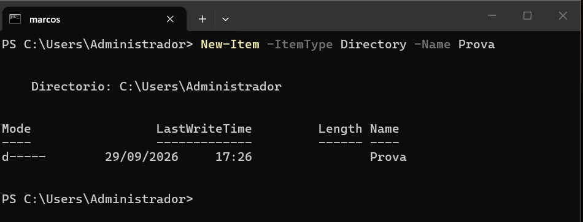
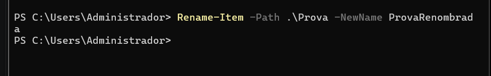
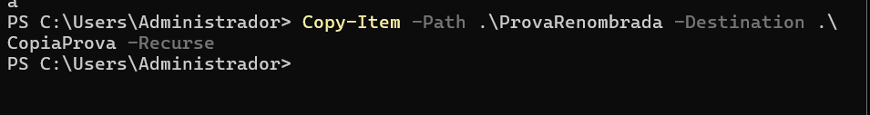
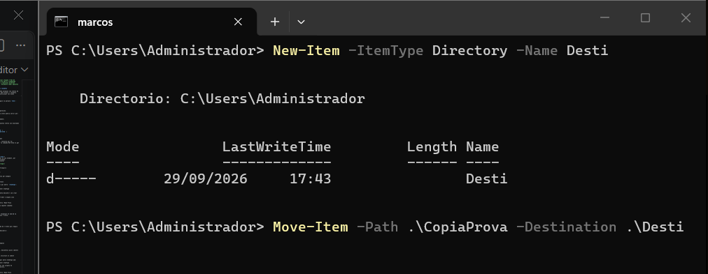

> **Nota**: Els exercicis/pràctiques t'han de servir per a familiarizar-te amb el llenguatge Powershell. Aprofita per a realitzar diverses proves i veure què passa. Documenta també aquestes proves i resultats.
prova
# Treballar amb fitxers i carpetes

**Situació:** encara no hem estudiat les ordres de PowerShell per treballar amb fitxers i carpetes. Les haurem de descobrir utilitzant les eines d'ajuda de PowerShell.

**1. Buscar ordres**

Busca cmdlets que continguin la paraula `Item`:

```
Get-Command *Item*

```

Observa les ordres que apareixen.

Intenta identificar quina ordre podria servir per:

- crear un element;
- eliminar un element;
- canviar el nom d'un element;
- copiar un element;
- moure un element.
he ficat la comanda i aquestes ordres son exactamen tles següents:
| Acció | Cmdlet |
|---|---|
| Crear | `New-Item` |
| Eliminar | `Remove-Item` |
| Canviar el nom | `Rename-Item` |
| Copiar | `Copy-Item` |
| Moure | `Move-Item` |
---

**2. Investigar una ordre**

Sense executar-la encara, consulta què fa:
Serveix per veure que la la comanda Net-Item el get help es molt descripriva


```
Get-Help New-Item
```

Respon:

- Per a què serveix `New-Item`?
New-Item serveix per crear un nou element, per exemple un fitxer o una carpeta.
- Quina estructura té l'ordre?
SINTAXIS
    New-Item [-Path] <string[]>  [<CommonParameters>]

    New-Item [[-Path] <string[]>]  [<CommonParameters>]

Consulta alguns exemples:

```
Get-Help New-Item -Examples per exemple
```
---

**3. Descobrir un paràmetre**

Consulta què significa el paràmetre `-ItemType`:

```
Get-Help New-Item -Parameter ItemType
```

A partir de l'ajuda, intenta descobrir com crear una carpeta.

Per exemple, haurien d'arribar a alguna cosa semblant a:

```
New-Item -ItemType Directory -Name Prova
```
Per fer aixo he trobat la següent comanda:

---

**4. Nou repte**

Ara necessites saber com **canviar el nom de la carpeta**, però no coneixes l'ordre.

Utilitza:

```
Get-Command *Item*
```

i després consulta l'ajuda de l'ordre que creguis adequada.

L'objectiu és arribar a descobrir:

```
Rename-Item
```

i consultar:

```
Get-Help Rename-Item -Examples
```

---

Sense utilitzar Internet, descobreix quins cmdlets faries servir per:

1. crear una carpeta;
Per crear una carpeta he utilitzat el cmdlet New-Item.

Primer he investigat el paràmetre ItemType amb:

Get-Help New-Item -Parameter ItemType

He descobert que per crear una carpeta he d'utilitzar el tipus Directory.

Comanda executada:

New-Item -ItemType Directory -Name Prova

Resultat:
S'ha creat correctament una carpeta anomenada Prova.

Per fer aixo fiquem la següent comanda:

2. Cambiar el nom;

He tornat a buscar els cmdlets amb:

Get-Command *Item*

He identificat Rename-Item.

Després he consultat la seva ajuda:

Get-Help Rename-Item

I els exemples:

Get-Help Rename-Item -Examples

Rename-Item serveix per canviar el nom d'un element.

Comanda executada:

Rename-Item -Path .\Prova -NewName ProvaRenombrada

Resultat:
La carpeta Prova ha passat a anomenar-se ProvaRenombrada.

3. copiar-la;

Amb Get-Command *Item* he identificat el cmdlet Copy-Item.

He consultat:

Get-Help Copy-Item
Get-Help Copy-Item -Examples

Copy-Item permet copiar un element.

Comanda executada:

Copy-Item -Path .\ProvaRenombrada -Destination .\CopiaProva -Recurse

Resultat:
S'ha creat una còpia de la carpeta amb el nom CopiaProva.
4. moure-la;

He identificat el cmdlet Move-Item utilitzant:

Get-Command *Item*

He investigat el cmdlet amb:

Get-Help Move-Item
Get-Help Move-Item -Examples

Move-Item permet moure un element d'una ubicació a una altra.

Primer he creat una carpeta anomenada Desti:

New-Item -ItemType Directory -Name Desti

Després he executat:

Move-Item -Path .\CopiaProva -Destination .\Desti

Resultat:
La carpeta CopiaProva s'ha mogut dins de la carpeta Desti.
5. eliminar-la.


**Condició:** només pots utilitzar `Get-Command` i `Get-Help` per investigar les ordres.

Descobrir ordres de xarxa amb PowerShell

## Situació

Estàs administrant un servidor Windows i necessites consultar informació de la seva configuració de xarxa.

Encara no coneixes les ordres de PowerShell relacionades amb xarxa.

La teva feina és descobrir-les utilitzant principalment:

```
Get-Command
Get-Help
```

No pots buscar les respostes a Internet.

---

## Tasques

Descobreix quines ordres de PowerShell et permeten obtenir la informació següent:

1. Mostrar els adaptadors de xarxa de l’equip.      
2. Consultar les adreces IP configurades.      
3. Consultar la configuració IP completa dels adaptadors de xarxa.      
4. Consultar els servidors DNS configurats.      
5. Comprovar si hi ha connectivitat amb un altre equip de la xarxa.  

---
## Per cada tasca

Indica:

- el cmdlet que has trobat;      
- com l’has localitzat amb `Get-Command`;  
- una breu explicació del que fa;  
- la comanda que has executat;  
- el resultat obtingut.  

L'objectiu és que hi hagi una traçabilitat de com s'ha arribat a la comanda final.