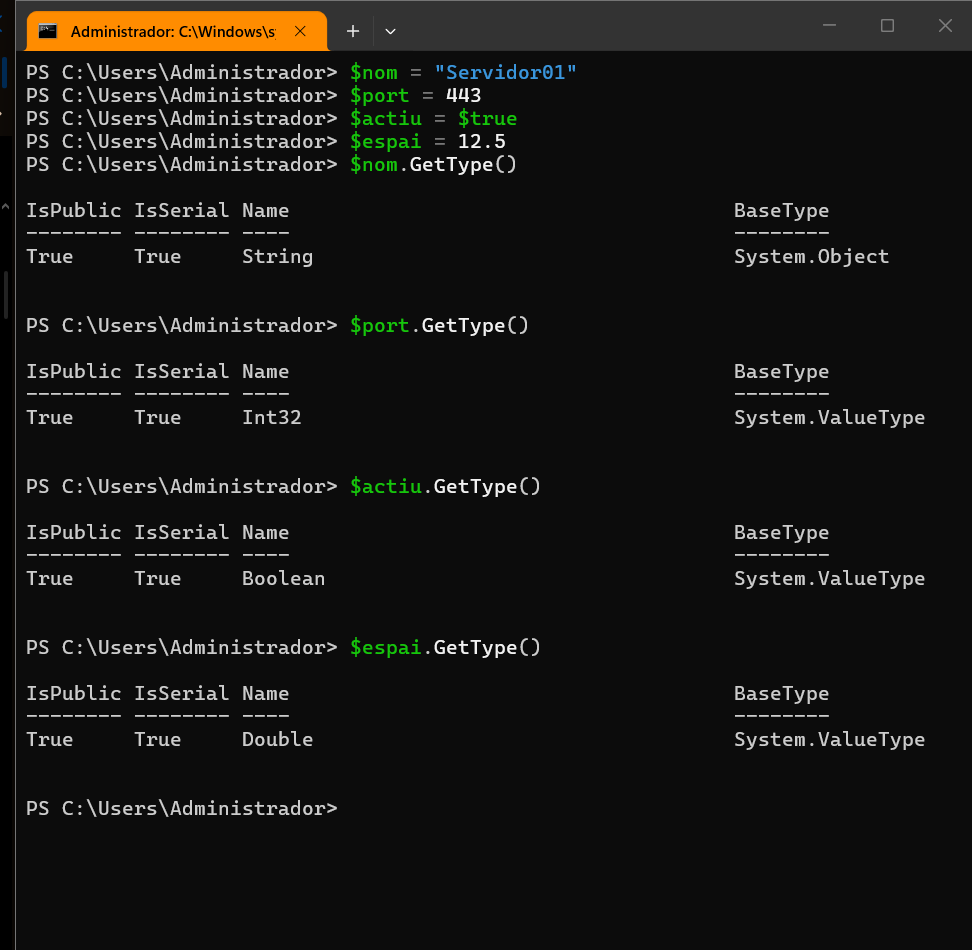
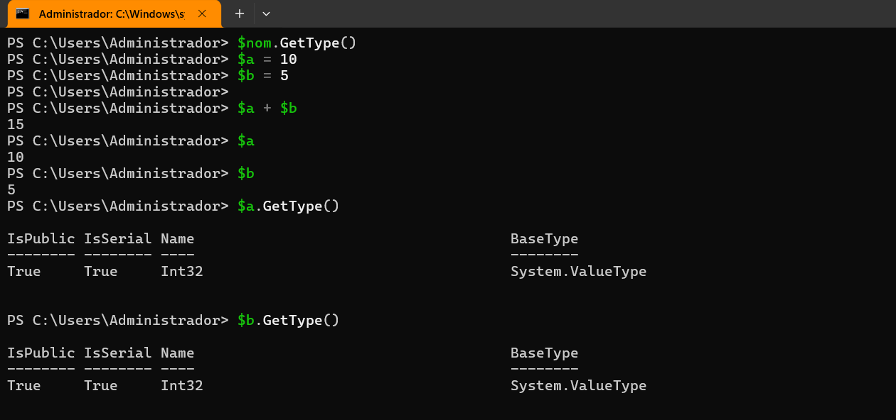
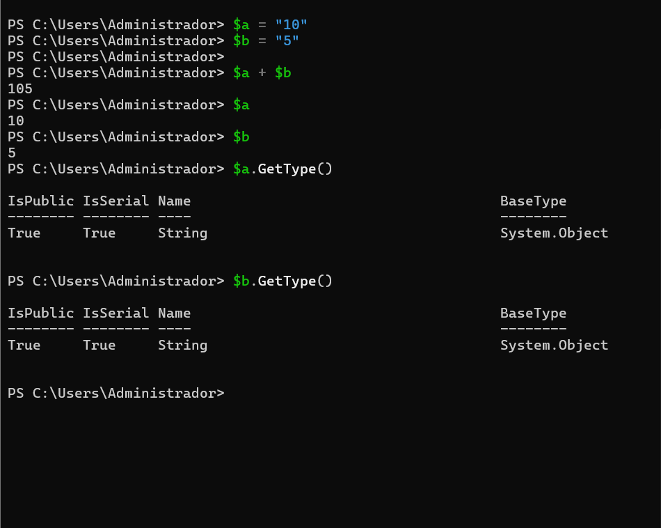
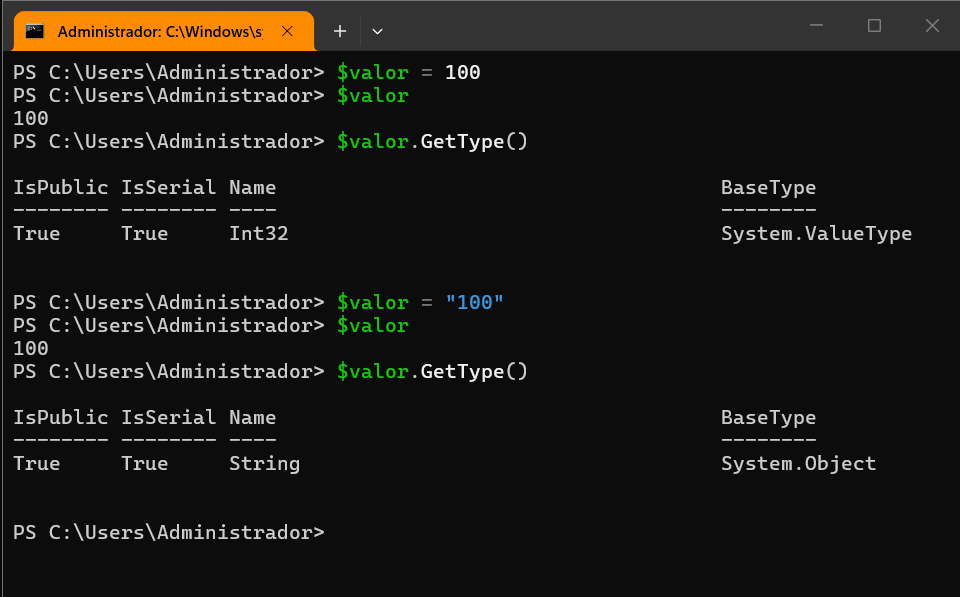
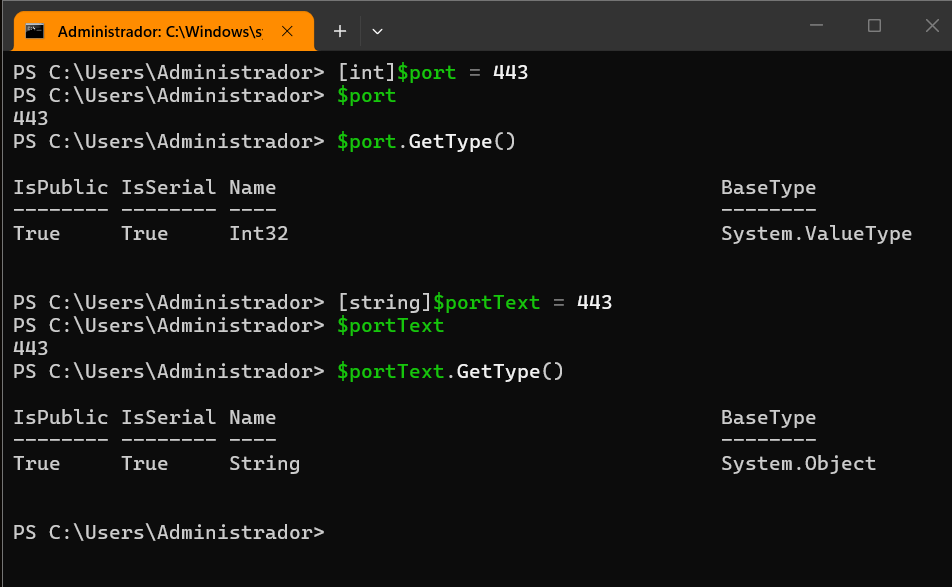
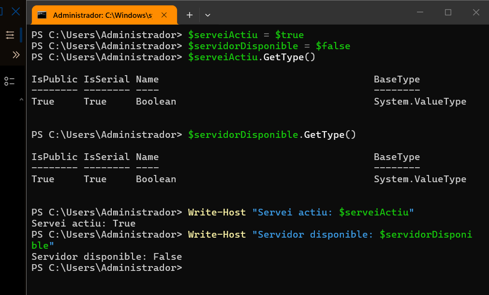

> **Nota**: Els exercicis/pràctiques t'han de servir per a familiarizar-te amb el llenguatge Powershell. Aprofita per a realitzar diverses proves i veure què passa. Documenta també aquestes proves i resultats.
# Tipus de dades

## 1. Identificar tipus

Crea les variables següents:
```powershell
$nom = "Servidor01"
$port = 443
$actiu = $true
$espai = 12.5
```
Consulta el tipus de cadascuna amb:
```powershell
.GetType()
```
Completa una taula com aquesta:

| Variable | Valor        | Tipus |
| -------- | ------------ | ----- |
| $nom     | `Servidor01` |       |
| $port    | `443`        |       |
| $actiu   | $true        |       |
| $espai   | `12.5`       |       |

Per fer aixo farem lo següent:

aqui hem deckatar lws variables i hem comprovar le sey type que es scrint int bolean i double que ser anum amb decimals 
| Variable | Valor | Tipus |
|---|---|---|
| `$nom` | `Servidor01` | String |
| `$port` | `443` | Int32 |
| `$actiu` | `$true` | Boolean |
| `$espai` | `12.5` | Double |

## 2. Número o text?

Executa:
```powershell
$a = 10
$b = 5

$a + $b
```
Després:
```powershell
$a = "10"
$b = "5"

$a + $b
```
Per fer aixo farem lo següent:



aqui hem fet les dues proves tant amb valors numerics com amb valors tipus text es veu que en numerics son type int32 i es sumen be , despres si es fa amb string no es sumen es concatenen i 10+5 es 105 per que es tipus string 
## 3. Canviar el tipus d'una variable

Executa:
```powershell
$valor = 100
```
Consulta:
```powershell
$valor.GetType()
```
Ara executa:
```powershell
$valor = "100"
```
i torna a consultar:
```powershell
$valor.GetType()
```

aqui es veu que hem assignat valro int 100 i hem comprovat despres hem agafat la mateixa variable i lem declarat a 100 amb valor tipus string (ficant le scometes) i sa cambiat de manera correcte 
## 4. Tipus explícits

Executa:
```powershell
[int]$port = 443
```
Comprova el tipus:
```powershell
$port.GetType()
```
Ara prova:
```
[string]$portText = 443
```
Consulta també:
```powershell
$portText.GetType()
```
Respon:

**Tot i que visualment els dos valors semblen `443`, són del mateix tipus?**

>aqui es veu que he fet port declarat explicitament com aint i es veu que es type int(numero) i despres he fet el mateix com a string i despres amb el get type ho he comprovat si es declara explicitaemnt es ficara com tu diguis no com es detecta automaticament i noc alen les cometes.
## 5. Booleans

Crea:
```powershell
$serveiActiu = $true
$servidorDisponible = $false
```
Consulta els tipus.

Després mostra un missatge amb:
```
Write-Host "Servei actiu: $serveiActiu"
Write-Host "Servidor disponible: $servidorDisponible"
```

Aqui es veu que hem declarat la variable com a true i laltre com a false i despres hem fet write host servei actiu i la variable i laltre servidor disponible i la variable hem comprovat que fossin voleans i despres sha comprovat amb la sortida de la comanda que ho he fet be 
## 6. General

Crea variables per representar un servidor amb aquesta informació:
```
Nom: SRV-WEB01
Port: 443
Espai lliure: 125.7 GB
Actiu: True
```
Després:

1. mostra el valor de totes les variables;
2. consulta el tipus de cadascuna;
3. indica quin tipus de dada has utilitzat per cada valor.