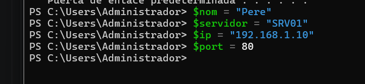
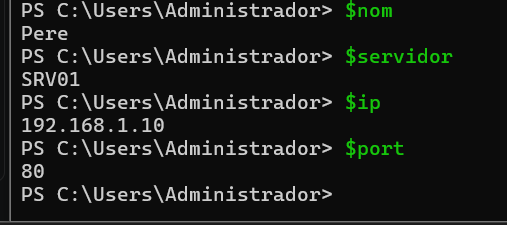
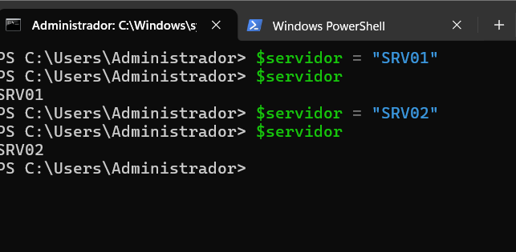
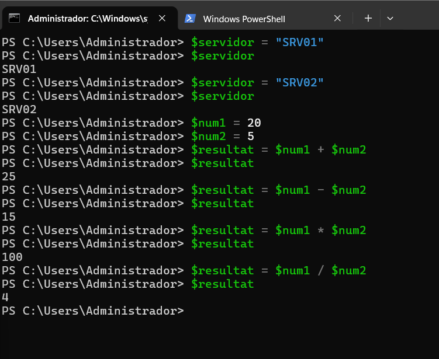
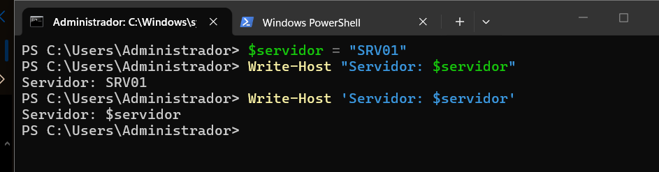
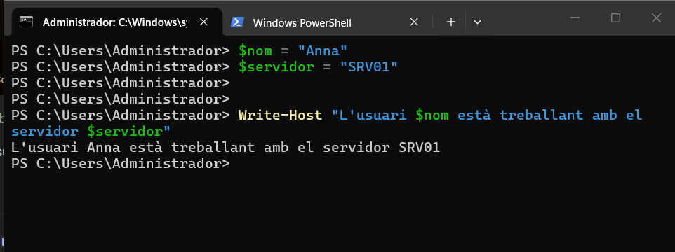
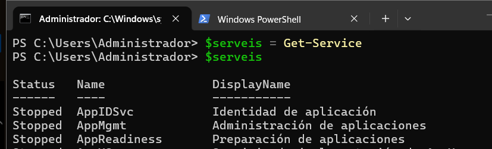
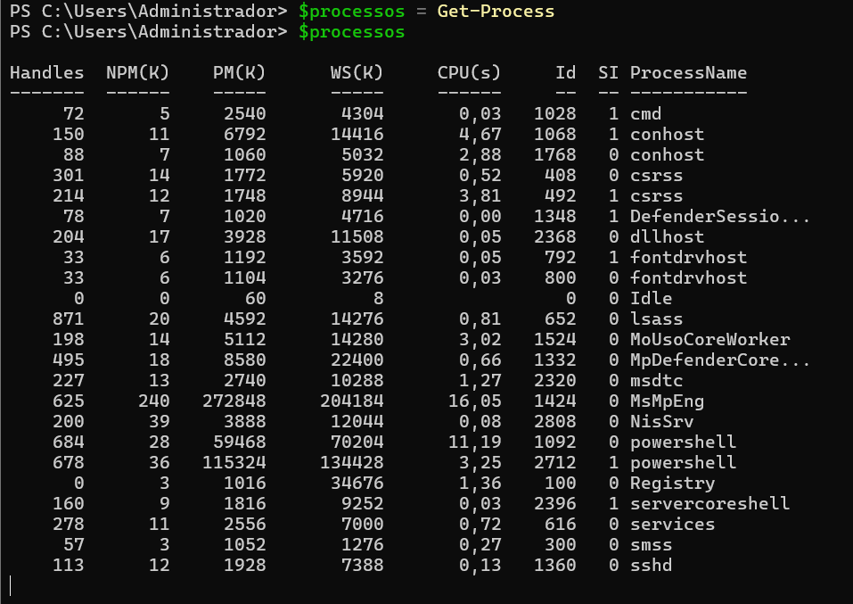
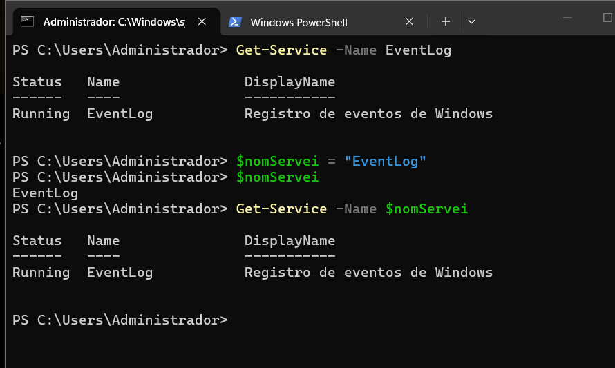

> **Nota**: Els exercicis/pràctiques t'han de servir per a familiarizar-te amb el llenguatge Powershell. Aprofita per a realitzar diverses proves i veure què passa. Documenta també aquestes proves i resultats.
# Treballar amb variables

## 1. Crear variables

Crea les variables següents:

```
$nom
$servidor
$ip
$port
```

Assigna-hi valors.

Per exemple:

```
$nom = "Pere"
```

Mostra després el contingut de cadascuna de les variables.

i per mirarles:

---

## 2. Modificar una variable

Crea:

```
$servidor = "SRV01"
```

Mostra el seu valor.

Després canvia'l per:

```
SRV02
```

Comprova quin valor conserva la variable.

---

aqui es veu que si camboiem el valor de la variable pero un altre es manbte el ultim que hem ficat o declarat

## 3. Operacions

Crea dues variables:

```
$num1 = 20
$num2 = 5
```

Crea una tercera variable que guardi:

- la suma;
- la resta;
- la multiplicació;
- la divisió.

Per exemple:

```
$resultat = $num1 + $num2
```

Mostra cada resultat.

aqui es veu com declarem num 1 i 2 i despres fem calculs guardantlos en resultat en cada calcul es cmabia el valor de la variabel resultat  i es veu que podem fer servir variables per varis calculs sense que es èrdi el valro de les variables fetes servir 
---

## 4. Variables dins d'un text

Crea:

```
$nom = "Anna"
$servidor = "SRV01"
```

Intenta obtenir aquesta sortida:

```
L'usuari Anna està treballant amb el servidor SRV01
```

utilitzant les variables dins del text.
 per fer-ho hem fet un texte de cometes dobles amb les variables i sapliquem com es veu a la següent captura:
 
---

## 5. Cometes

Executa:

```
$servidor = "SRV01"
```

Després:

```
Write-Host "Servidor: $servidor"
```

i:

```
Write-Host 'Servidor: $servidor'
```

Respon:


**Quina diferència observes? Per què creus que passa?**

el que pasa es que amb cometes dobles detecta les variables i amb simples no es a dir ho fa tot com a text i literalment lestas dient escriu Servidor: $servidor

---

## 6. Guardar el resultat d'una ordre

Executa:

```
$serveis = Get-Service
```

Després:

```
$serveis
```


Respon:

- Què creus que conté $serveis?
conte una rray amb tots els serveis que doan la comanda get services
- La variable conté un únic valor o diversos elements?
Conte molts elements a dins de un array
ho podriem comprovar amb auqesta comanda que com es veu returna 117:
```powershell
PS C:\Users\Administrador> $serveis.Count
117
PS C:\Users\Administrador>
```

Fes el mateix amb:

```
$processos = Get-Process
```

i comprova el seu contingut.

aquie s veu com guarda tal cual els proccesos en un bon format 

La variable $processos conté el resultat del cmdlet Get-Process.

Per tant, conté diversos elements, concretament objectes que representen els processos que s'estan executant al sistema.

El contingut pot variar perquè els processos actius poden ser diferents en cada moment.
---

## 7. Aplicació a administració

Crea una variable:

```
$nomServei = "Spooler"
```

Utilitza aquesta variable per consultar el servei amb:

```
Get-Service -Name ...
```

L'objectiu és obtenir el mateix resultat que:

```
Get-Service -Name Spooler
```

però **sense escriure `Spooler` directament en el cmdlet**.

per ferho hem buscat uns ervei que tinguem per que spooler no el tenim i lem guardat a una variable despres hem fet get service -name i hem ficat la variable come s veu a continuacio:
